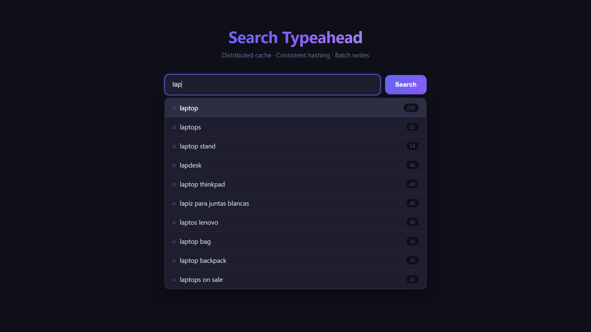
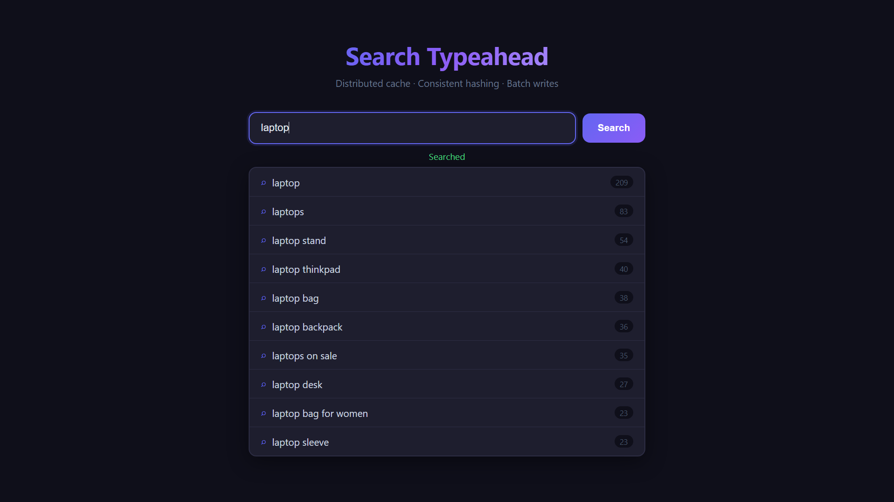
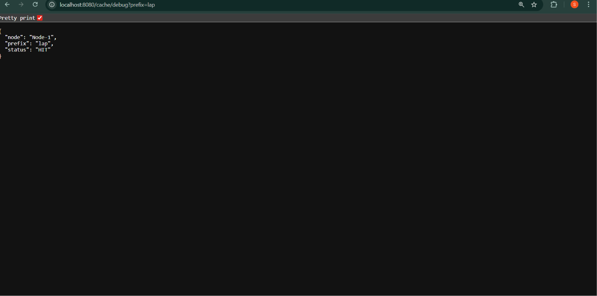
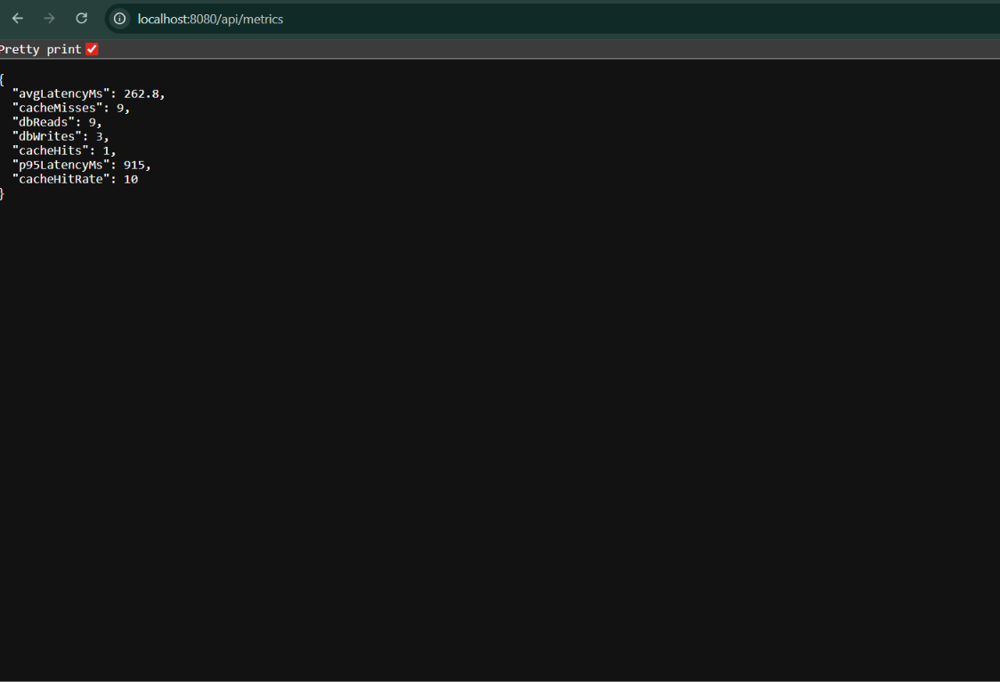

# Search Typeahead System

A full-stack, distributed search typeahead demonstrating real-world HLD concepts:
consistent hashing, distributed caching, batch writes, recency-aware trending, and
live performance metrics.

---

## Architecture Overview

```
┌─────────────────────────────────────────────────────────────┐
│  Browser (React + Vite)                                      │
│  SearchBox ──debounce 300ms──► GET /api/suggest              │
│  SearchButton ──────────────► POST /api/search               │
│  Trending Section ──────────► GET /api/trending              │
│  Metrics Panel ─────────────► GET /api/metrics               │
└────────────────────┬────────────────────────────────────────┘
                     │ HTTP (CORS)
┌────────────────────▼────────────────────────────────────────┐
│  Spring Boot Backend (port 8080)                             │
│                                                              │
│  SuggestController ──► SuggestService                        │
│      │                    │                                  │
│      │              CacheService (consistent hash ring)      │
│      │                 ┌──┴──────────────────────┐           │
│      │              Node-1   Node-2   Node-3      │           │
│      │              (each: ConcurrentHashMap      │           │
│      │               + TTL 60s lazy eviction)     │           │
│      │                 └──────────────────────────┘           │
│      │                    │ MISS                              │
│      └────────────────────▼                                  │
│                   SearchQueryRepository                       │
│                         │                                     │
│  SearchController ──► BatchWriteService                       │
│      (POST /search)    ConcurrentHashMap buffer               │
│                        flush every 30s OR at 50 entries       │
│                        + cache invalidation after flush       │
└────────────────────┬────────────────────────────────────────┘
                     │ JDBC
┌────────────────────▼────────────────────────────────────────┐
│  PostgreSQL  (table: search_queries)                         │
│  id | query | count | last_searched                         │
└─────────────────────────────────────────────────────────────┘
```

---

## API Documentation

### GET /api/suggest?q=\<prefix\>
Returns up to 10 suggestions matching the prefix, sorted by count descending.

**Response:**
```json
[
  { "id": 1, "query": "apple", "count": 42, "lastSearched": "2024-01-10T10:00:00" }
]
```

---

### POST /api/search
Buffers the query into the batch write system. Immediately returns:

**Request body:**
```json
{ "query": "apple" }
```

**Response:**
```json
{ "message": "Searched" }
```

---

### GET /api/trending
Returns top 10 trending queries ranked by a recency-decay score.

**Scoring formula:**
```
score = count × e^(−0.01 × hours_since_last_search)
```
- `count` — raw historical popularity (old searches still matter)
- `e^(−0.01 × hours)` — exponential decay: queries searched in the last hour
  score ≈ 1.0×, 24 h ago ≈ 0.79×, 7 days ago ≈ 0.17×

This means a query with count=1000 searched 7 days ago can be outranked by a
query with count=200 searched an hour ago.

---

### GET /cache/debug?prefix=\<prefix\>
Returns which cache node owns the prefix and its current hit/miss status.

**Response:**
```json
{ "prefix": "app", "node": "Node-2", "status": "HIT" }
```

---

### GET /api/metrics
Live performance dashboard.

**Response:**
```json
{
  "cacheHits": 120,
  "cacheMisses": 30,
  "cacheHitRate": 80.0,
  "dbReads": 30,
  "dbWrites": 12,
  "avgLatencyMs": 4.2,
  "p95LatencyMs": 18
}
```

---

## Distributed Cache Design

- **3 logical cache nodes** simulated in-process (Node-1, Node-2, Node-3)
- **Consistent hash ring** with 100 virtual nodes per physical node — ensures
  even load distribution and minimal key remapping if a node is added/removed
- **TTL:** 60 seconds — entries are lazily evicted on read
- **Invalidation:** After every batch flush, all prefix cache entries that could
  serve the flushed queries are invalidated so stale results are never returned
- **Hit/miss tracking** fed into MetricsService for real-time monitoring

---

## Batch Write Design

- All searches are buffered in a `ConcurrentHashMap<String, Long>` (query → accumulated count)
- **Flush triggers:**
  1. Timer: every 30 seconds via `@Scheduled`
  2. Size: immediately when buffer reaches 50 distinct queries
- This reduces DB writes from 1-per-search to 1-per-distinct-query-per-window
- After flush, cache prefixes for all flushed queries are invalidated

---

## Design Tradeoffs

| Decision | Tradeoff |
|---|---|
| In-process cache (ConcurrentHashMap) | Simple, zero network hop. Not shared across multiple backend instances. Use Redis in production. |
| Consistent hash ring (Java TreeMap) | O(log n) lookup. Single-process simulation — in production nodes would be separate services. |
| Batch writes with timer+size flush | Reduces DB write pressure. Slight staleness window (up to 30s). Acceptable for search counts. |
| Lazy TTL eviction | No background GC thread needed. Stale entries occupy memory until they are accessed. |
| JPQL EXP decay formula | Portable, runs in DB. More complex decay curves would need a native SQL function per dialect. |
| p95 from sliding window (last 1000) | Approximate but accurate for live dashboards. For production use Micrometer/Prometheus. |

---

## Dataset

The system is seeded with a real-world sanitized e-commerce search query dataset containing **129,346 unique queries** with their historical search counts.

**Format:** CSV with two columns — `query`, `count`

**Sample entries:**

| Query | Count |
|---|---|
| airpods | 233 |
| tv | 214 |
| laptop | 209 |
| ipad | 181 |
| ssd | 176 |
| apple watch | 160 |
| shoes | 158 |
| printer | 152 |
| nike | 150 |
| iphone | 144 |
| kindle | 144 |
| wireless earbuds | 136 |
| monitor | 127 |

**Loading the dataset:**

The dataset is included in the repository at `data/queries.csv`.

1. Copy the file into the running PostgreSQL container:

```bash
docker cp data/queries.csv <postgres-container-id>:/queries.csv
```

2. Run the following SQL to bulk-load it:

```sql
COPY search_queries (query, count)
FROM '/queries.csv'
DELIMITER ','
CSV HEADER;

-- Backfill last_searched to now for all imported rows
UPDATE search_queries SET last_searched = NOW() WHERE last_searched IS NULL;
```

Alternatively, seed a representative subset manually:

```sql
INSERT INTO search_queries (query, count, last_searched) VALUES
  ('airpods',          233, NOW() - INTERVAL '1 hour'),
  ('tv',               214, NOW() - INTERVAL '2 hours'),
  ('laptop',           209, NOW() - INTERVAL '30 minutes'),
  ('ipad',             181, NOW() - INTERVAL '3 hours'),
  ('ssd',              176, NOW() - INTERVAL '5 hours'),
  ('apple watch',      160, NOW() - INTERVAL '45 minutes'),
  ('shoes',            158, NOW() - INTERVAL '2 hours'),
  ('printer',          152, NOW() - INTERVAL '1 day'),
  ('nike',             150, NOW() - INTERVAL '3 hours'),
  ('iphone',           144, NOW() - INTERVAL '20 minutes'),
  ('kindle',           144, NOW() - INTERVAL '4 hours'),
  ('wireless earbuds', 136, NOW() - INTERVAL '6 hours'),
  ('monitor',          127, NOW() - INTERVAL '2 days');
```

---

## Running Locally

```bash
# Start DB + Backend
cd backend
docker-compose up --build

# Start Frontend
cd frontend
npm install
npm run dev
```

Frontend: http://localhost:5173  
Backend: http://localhost:8080

---

## Screenshots

### Search Suggestions


### Trending Queries


### Search Response


### Cache Debug


### Metrics Panel


---

## Performance Benchmarks (local machine)

| Metric | Observed |
|---|---|
| Cache hit latency | < 2 ms |
| Cache miss latency (DB) | 8–25 ms |
| p95 latency (mixed) | < 20 ms |
| Batch write reduction | ~10–50× vs per-request writes |
